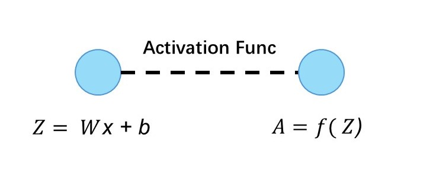
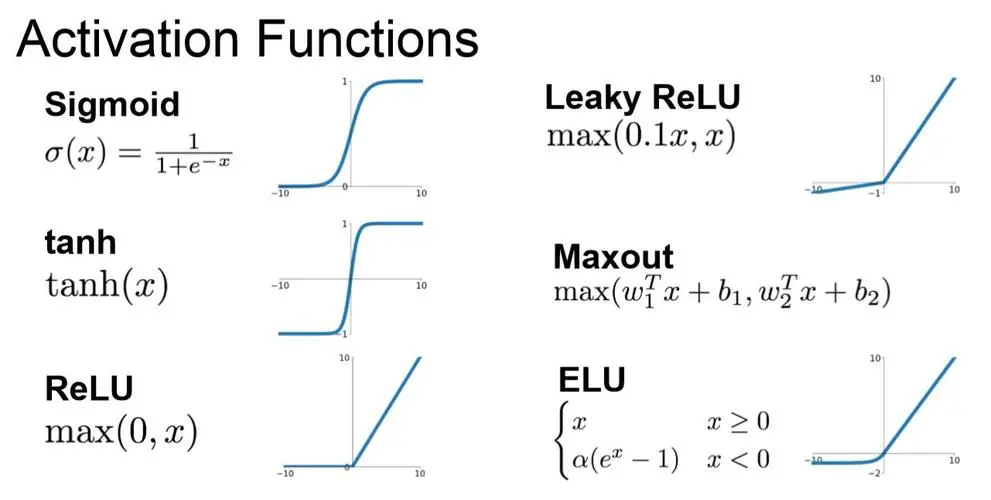

# MLP & MFCC Phoneme Recognition

[MLP](##MLP-Details)

[Phoneme Recognition](##Phoneme-Recognition-Task)

## MLP Details
As mentioned in the readme file, the MLP models usually look like this.


And for each node in the picture, it is a linear calculation, which can be represented as "Wx + b", where w is the weight of this node and b is the bias. 

With a given number N, we can create N cells in each layer and connect them with the previous/next layer with weights and bias.


However, linear equation like "Wx + b" can only represent linear relationship. To mimic non-linear relationships in real world, we introduced activation functions.




Activation functions are an indispensable part of neural networks. By introducing non-linearity, they enable the network to learn and represent complex non-linear relationships, 
making it capable of handling complex tasks such as image recognition and natural language processing.

## Model and hyperparameters
For a fully-functioning MLP with loss function and SGD in python, it contains these attributes:
- l: list of model layers
- L: number of model layers
- lr: learning rate
- mu: momentum rate µ, tunable hyperparameter controlling how much the previous updates affect
the direction of current update. µ = 0 means no momentum
- W: list of weight velocity for each layer
- b: list of bias velocity for each layer

```python
import numpy as np

class SGD:

    def __init__(self, model, lr=0.1, momentum=0):
        self.l = model.layers
        self.L = len(model.layers)
        self.lr = lr
        self.mu = momentum
        self.v_W = [np.zeros(self.l[i].W.shape, dtype="f") for i in range(self.L)]
        self.v_b = [np.zeros(self.l[i].b.shape, dtype="f") for i in range(self.L)]

    def step(self):
        for i in range(self.L):
            if self.mu == 0:
                self.l[i].W = self.l[i].W - self.lr * self.l[i].dLdW
                self.l[i].b = self.l[i].b - self.lr * self.l[i].dLdb
            else:
                self.v_W[i] = self.mu * self.v_W[i] + self.l[i].dLdW
                self.v_b[i] = self.mu * self.v_b[i] + self.l[i].dLdb
                self.l[i].W = self.l[i].W - self.lr * self.v_W[i]
                self.l[i].b = self.l[i].b - self.lr * self.v_b[i]
```

## Phoneme Recognition Task
After knowing how a MLP works, now we can use this model to predict/classify data. 
For this task, we are provided a dataset of audio recordings (utterances) and their phoneme state (subphoneme) labels. The data comes from articles published in
the Wall Street Journal (WSJ) that are read aloud and labelled using the original text. 

As letters are the atomic elements of written language, phonemes are the atomic elements of speech. It is
crucial for us to have a means to distinguish different sounds in speech that may or may not represent the
same letter or combinations of letters in the written alphabet.

For this challenge, we will consider a total of 40 phonemes in this language.


A powerful technique in speech recognition is to model speech as a markov process with unobserved states.
This model considers observed speech to be dependent on unobserved state transitions. We refer to these
unobserved states as phoneme states or subphonemes. For each phoneme, there are 3 respective phoneme
states. The transition graph of the phoneme states for a given phoneme is as follows:

Example: [”+BREATH+”, ”+COUGH+”, ”+NOISE+”, ”+SMACK+”, ”+UH+”, ”+UM+”, ”AA”, ”AE”,
”AH”, ”AO”, ”AW”, ”AY”, ”B”, ”CH”, ”D”, ”DH”, ”EH”, ”ER”, ”EY”, ”F”, ”G”, ”HH”, ”IH”, ”IY”,
”JH”, ”K”, ”L”, ”M”, ”N”, ”NG”, ”OW”, ”OY”, ”P”, ”R”, ”S”, ”SH”, ”SIL”, ”T”, ”TH”, ”UH”, ”UW”,
”V”, ”W”, ”Y”, ”Z”, ”ZH”]

The data provided in this task consists of these melspectrograms, and phoneme labels
for each 27-dimensional vector in the melspectrogram. Our final goal is to predict
the label of a particular 27-dimensional vector in an utterance (40 different labels).


