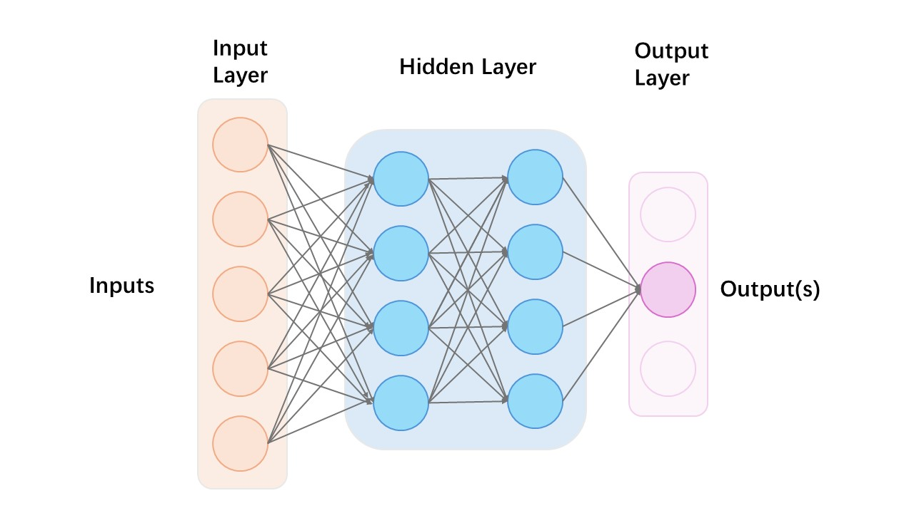

# Machine Learning
This repo contains several small projects about machine learning and deep learning that we encountered during study. 

Different ml/dl models are introduced as we go deeper into the study. Starting from basic mlp to cnn, rnn, and last, we gonna build a micro-transformer model! 

## MLP 
The Multilayer Perceptron (MLP) is a fundamental type of neural network consisting of fully connected layers. It is capable of addressing straightforward tasks such as classification and regression. As the number of layers increases, the MLP can uncover more intricate patterns and relationships within the data.

To understand this model, I created an MLP for frame-level speech recognition using MFCCs. The MLP learned feature representations and classification boundaries for phonemes. Cross-entropy loss was used to compare the MLP's output with target labels, guiding parameter updates during training to improve speech transcription accuracy.

[Kaggle Competition-Frame-Level Speech Recognition](https://www.kaggle.com/competitions/11-785-s23-hw1p2)

## CNN

## RNN & LSTM

## Transformer

